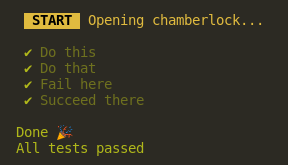
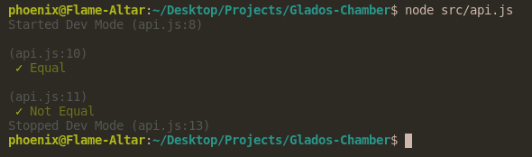

<div align="center">
    
</div>

# Glados Chamber

It's a tiny testing library that gives you the flexibility to quickly perform needed tests of your package, framework, library or app. This library is inspierd by jest which came out to be too overengineered for my needs. When I think of performing tests - I instantly imagine Glados. Hence the name

<div align="center">
 
</div>

## Installation 🔧

```bash
npm install glados-chamber -g
```

## Usage ⚙️

```bash
glados path/to/file.js --voice
```

If you wish to not play Glados voice when testing
simply remove `--voice` flag from the snippet above

**file.js**

```js
// If returned true - test passed
test('This is a title', () => {
    return 15 > 5
})

// Match values
equal('Matching...', typeof null, 'object', typeof {})

// Not equal
nequal('These should be different', [], 0, false)

// Anticipate failure
fail('It must fail...', () => throw 'Failed!')

// Anticipate success
succeed('It must succeed...', () => 15)
```

Besides of the testing functions there are available helper functions that can help you in testing process.

```js
log(`Value returned: ${variable}`)
warn('Remember to run ./script.sh before testing!')
```

### Flags

Here are flags which you can use with the `glados` binary

```bash
glados <path> [..flags]

Flags:
    --no-applause    | Shows when all tests were passed
    --no-error-quit  | Doesn't quit when stumbled upon an error
    --production     | Disables all glados chambers and functionalities (useful in API)
    --silent         | Doesn't show successes but shows errors
    --voice          | Enables Glados voice commentary
```

## API 🎍

You can import glados to your codebase and her chambers in your code.

```js
import glados from 'glados-chamber'
const glados = require('glados-chamber')

glados.equal('let us match these', true, 1) // Error
```

Passing flags via api is just as easy as running one function which takes an object and gives proxy in return... Just in case if you wanted to change some other settings after a while.

```js
// All existing options and their default values:
glados.config({
    applause: true,    // Shows when all tests were passed
    errorQuit: true,   // Quits on the first error
    production: false, // Disables all glados chambers and functionalities
    silent: false,     // Doesn't show successes but shows errors
    voice: false,      // Enables Glados voice commentary
})
```

I mentioned `glados.config` returns proxy... Here is a simple usage example:

```js
const SILENT = true
let conf = glados.config({ silent: SILENT, applause: false })

equal('Somthing less important', false, false)

// ...

conf.silent = false

// This one will appear in console
equal('Something Important')

conf.silent = SILENT

// WARNING!
// In this case dev mode is much more convenient - see below!
```

## Advanced usage

### Custom chambers

You can also create your own test chambers. Here is a simple example:

```js
const myEQ = create((success, error, title) => {
    return (uno, dos) => {
        log(`Title of this test: ${title}`)
        // Success case
        if (uno === dos) success()
        // Error case
        else error('Reason', 'Description text')
    }
})

myEQ('Equality check', 1, 2)
```

Here is a more advanced *success* and *error* function usage example:

```js
create((success, error) => {
    return (func) => {
        // Success case
        if (func()) success({ 
            title: 'Overwrite title of this test' 
        })
        // Error case
        else error({
            title: 'Overwrite title of this test',
            reason: 'Error explanation part',
            text: 'This could be like lorem ipsum',
            code: 1 // Exit code
        })
    }
})
```

#### Dev mode

Dev mode enables glados to notify (leaves a simple traceback) from where given tests are pasing or failing. What's more - it disables *silent* mode for this particular purpose so that you don't have to see all the tests in your code.

```js
const glad = require('./main')

glad.config({
    silent: true,
    applause: false
})

glad.dev(1)

glad.equal('Equal', 1, 1, 1, 1, 1, 1)
glad.nequal('Not Equal', [], 0, false)

glad.dev(0)

glad.test('Test', () => true)
glad.succeed('Test', () => {})
glad.fail('Test', () => {throw ''})
```

<div align="center">
    <br>
    <i>(Dev Mode terminal output)</i>
</div>


